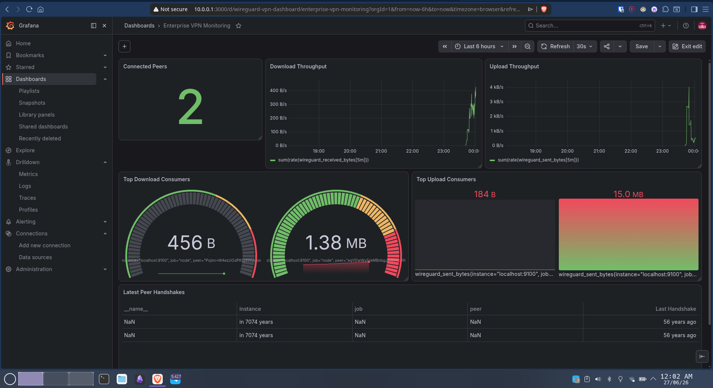

# Enterprise VPN Infrastructure

Enterprise-style WireGuard VPN deployed on AWS to provide secure remote access to private infrastructure and internal services.

## Overview

This project demonstrates how an enterprise VPN gateway can be deployed and managed using Infrastructure as Code. Instead of exposing internal services to the internet, authenticated users connect through encrypted WireGuard tunnels to securely access private infrastructure.

The project provisions AWS infrastructure using Terraform, automates VPN setup with Bash, supports multiple routing modes, and includes an observability stack powered by Prometheus and Grafana.

## Quick Start (view instructions.md for detailed steps)

```bash
git clone https://github.com/pavan-srikar/enterprise-vpn-infrastructure.git
cd enterprise-vpn-infrastructure

terraform init
terraform apply

sudo ./scripts/setup-tf-backend.sh
```

## Architecture


```
                Internet
                    │
                    ▼
             AWS EC2 (Ubuntu)
        ┌───────────────────────┐
        │      WireGuard        │
        │        wg0            │
        ├───────────────────────┤
        │  Node Exporter        │
        │  Textfile Collector   │
        │  Prometheus           │
        │  Grafana              │
        └───────────────────────┘
                    │
        VPN Clients (10.0.0.x)
```


## Traffic 

```
Remote Device 
│ 
▼ 
WireGuard VPN Tunnel 
│ 
▼ 
AWS EC2 VPN Gateway 
│ 
├────────► Internal Services 
├────────► Monitoring Stack 
└────────► Private Resources
```

## Features

### Infrastructure

- Terraform-based AWS deployment
- Remote Terraform state stored in encrypted S3 with versioning
- Automated EC2 provisioning
- Security Groups managed entirely through Terraform
- Fully reproducible infrastructure using Terraform

### VPN
- Automated WireGuard installation
- QR-code mobile onboarding
- Peer creation and removal scripts
- Live peer configuration updates
- Split Tunnel, Enterprise and Full Tunnel routing modes
- Automatic public IP detection with fallback providers
- IP forwarding and NAT configuration

### Security
- SSH restricted to allowlisted IPs
- Terraform validation prevents accidental 0.0.0.0/0 SSH access
- Secrets excluded from Git
- GitHub Actions secret scanning
- Monitoring
- Automated Prometheus installation
- Automated Grafana installation
- Node Exporter integration
- Custom WireGuard metrics exporter
- Automatic metrics collection via cron


### Monitoring Stack

The monitoring stack consists of:
```
WireGuard
      │
      ▼
Custom Metrics Exporter
      │
      ▼
Node Exporter Textfile Collector
      │
      ▼
Prometheus
      │
      ▼
Grafana Dashboard
```

### Metrics collected include:

- Connected peers
- Configured peers
- Upload bandwidth
- Download bandwidth
- Total bytes transferred
- Latest peer handshake
- Allowed IP configuration


### VPN dashboard showing:
- Connected peers
- Total peers
- Upload/download traffic
- Handshake status
- Live VPN statistics

### CI/CD
- ShellCheck
- Terraform validation
- Secret leak detection

---

## Networking

The VPN network uses the private subnet:

`VPN Server : 10.0.0.1`
`Clients    : 10.0.0.x`

Supported routing modes:

### Split Tunnel: `AllowedIPs = 10.0.0.0/24`
Only VPN network traffic is routed through WireGuard.

Example:
```
10.0.0.1  -> VPN Server
10.0.0.2  -> Mobile Device
10.0.0.3  -> Laptop
```

Internet traffic continues to use the client's normal connection.

### Enterprise Mode `AllowedIPs = 10.0.0.0/16`
Routes an entire private enterprise network through the VPN.

Example:
```
10.0.0.x  -> VPN Infrastructure
10.0.1.x  -> Applications
10.0.2.x  -> Databases
10.0.3.x  -> Monitoring
```

### Full Tunnel `AllowedIPs = 0.0.0.0/0`
Routes all internet traffic through the VPN gateway.

## Validation

The infrastructure was tested end-to-end using Android and Linux WireGuard clients, validating VPN connectivity, routing modes, peer management, and the monitoring stack.

### Successfully Tested

- Android WireGuard client
- Linux WireGuard client
- QR-based onboarding
- Split tunnel routing
- Full tunnel routing
- VPN-to-server communication
- Internal HTTP service access
- Prometheus metric collection
- Grafana dashboards
- Live WireGuard traffic monitoring

## Infrastructure & Security

### Terraform State Management
Remote state is stored in an encrypted S3 bucket with versioning enabled.
State is never stored locally or committed to the repository.

### SSH Security
SSH access is restricted to explicitly allowlisted IPs via Terraform security group rules.
The configuration enforces this at the variable validation level — `0.0.0.0/0` is rejected at plan time.

### Secrets Management
- Private keys, `.pem` files, and `.tfvars` are excluded via `.gitignore`
- CI pipeline scans for accidentally committed secrets on every push

## Technologies Used
- AWS EC2, S3
- WireGuard
- Ubuntu Linux
- Bash, ShellCheck (bash linting)
- iptables
- Linux Networking
- Terraform (Infrastructure as Code)
- GitHub Actions (CI validation)
- Prometheus
- Grafana

## Example Use Cases
- Secure employee remote access
- Internal dashboard access
- Private application access
- Infrastructure administration
- Development environment connectivity
- VPN gateway proof-of-concept deployments

## Future Improvements

- Internal DNS server
- Web management portal
- VPN user management
- Email-based peer provisioning
- High Availability deployment
- Multi-region VPN gateways
- Alertmanager integration
- VPN usage analytics

## Screenshots

### Scripts to add and remove clients


### Generating QR


### Split Tunnel


### Grafana Dashboard 


## Disclaimer

This project is intended for educational, infrastructure engineering, and security research purposes.
