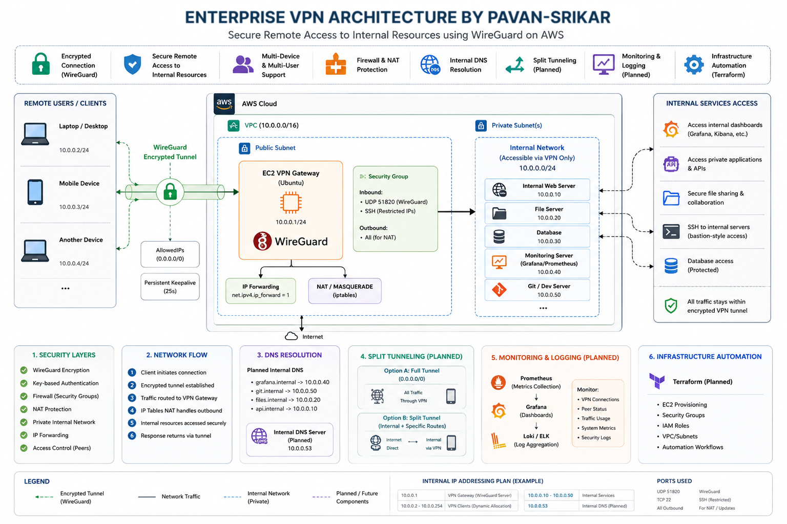
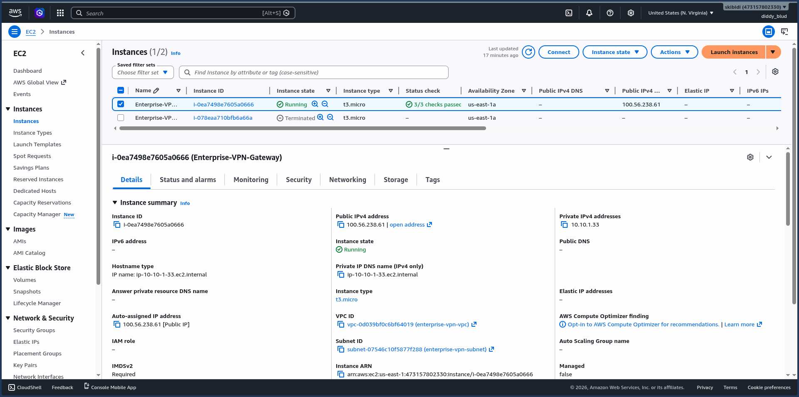
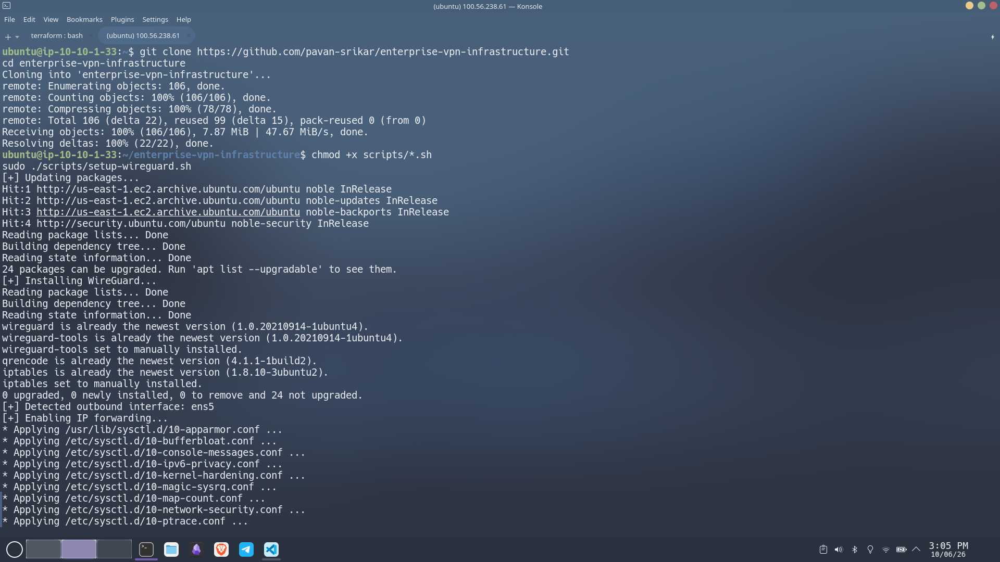
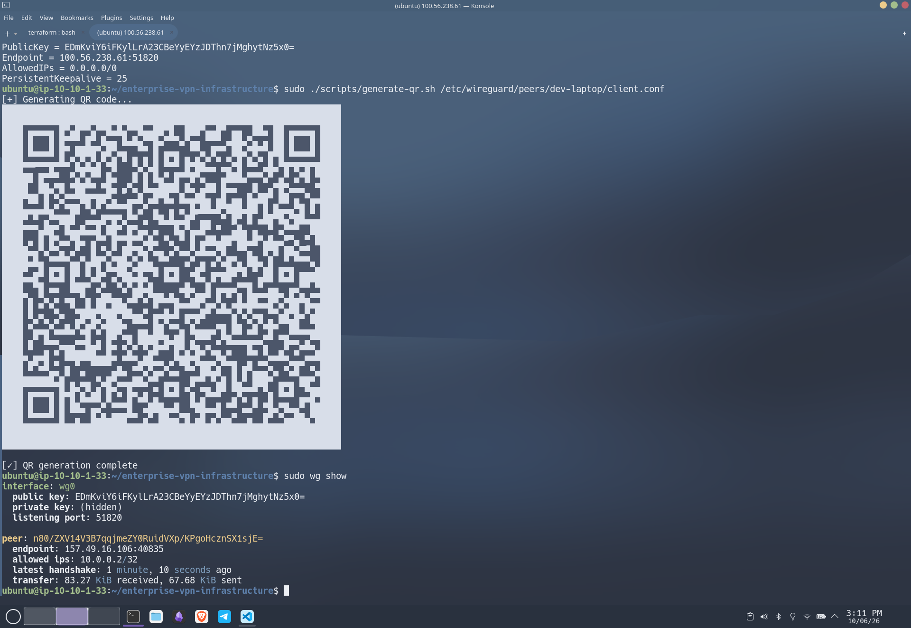
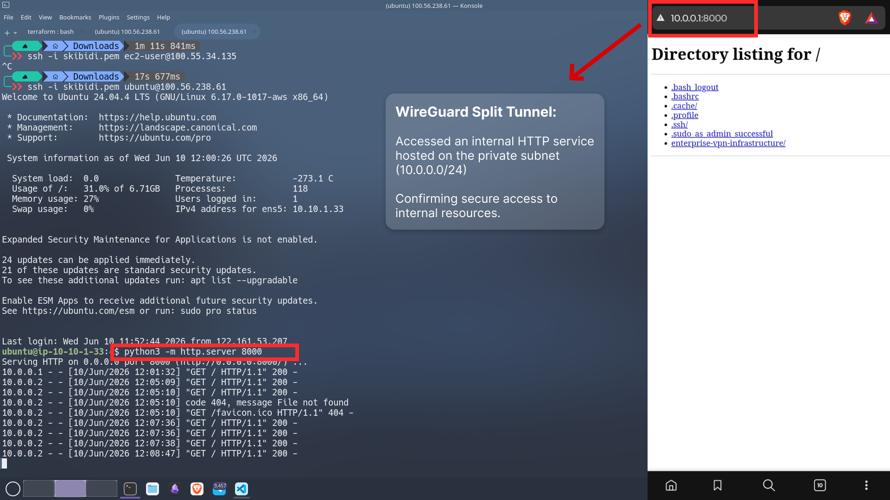

# Enterprise VPN Infrastructure

Enterprise-style WireGuard VPN deployed on AWS to provide secure remote access to private infrastructure and internal services.

## Overview

The goal is to simulate a real-world remote access solution where authenticated users can securely connect to internal resources through encrypted VPN tunnels instead of exposing services directly to the public internet.

The project includes automated VPN deployment, peer provisioning, QR-based onboarding, and configurable routing policies supporting split-tunnel and full-tunnel connectivity.

## Traffic 

```
Remote Device
↓
WireGuard VPN Tunnel
↓
AWS EC2 VPN Gateway
↓
Private Network Resources
```



## Features

### Implemented

* Automated WireGuard deployment on AWS EC2
* Secure encrypted VPN connectivity
* Automated peer provisioning
* QR-based mobile onboarding
* Dynamic network interface detection
* Automatic server public IP discovery
* Linux IP forwarding configuration
* NAT configuration using iptables
* Split Tunnel routing support (10.0.0.0/24)
* Enterprise Network routing support (10.0.0.0/16)
* Full Tunnel routing support (0.0.0.0/0)
* Multi-device connectivity
* Peer-based access control

### In Progress
* Internal DNS resolution
* Terraform-based infrastructure provisioning
* Grafana and Prometheus monitoring
* Security hardening automation
* Bastion-style internal access workflows

---

## Networking

The VPN network uses the private subnet:

`VPN Server : 10.0.0.1`
`Clients    : 10.0.0.x`

Supported routing modes:

#### Split Tunnel: `AllowedIPs = 10.0.0.0/24`
Only VPN network traffic is routed through WireGuard.

Example:
10.0.0.1  -> VPN Server
10.0.0.2  -> Mobile Device
10.0.0.3  -> Laptop

Internet traffic continues to use the client's normal connection.

#### Enterprise Mode `AllowedIPs = 10.0.0.0/16`
Routes an entire private enterprise network through the VPN.

Example:
10.0.0.x  -> VPN Infrastructure
10.0.1.x  -> Applications
10.0.2.x  -> Databases
10.0.3.x  -> Monitoring

#### Full Tunnel `AllowedIPs = 0.0.0.0/0`
Routes all internet traffic through the VPN gateway.

## Validation

The VPN was validated using a mobile WireGuard client.

### Testing confirmed:

- Successful VPN peer onboarding via QR code
- Secure client-to-server communication
- Split tunnel functionality
- Access to an internal HTTP service hosted on the VPN server
- WireGuard peer handshakes and traffic transfer verification

## Technologies Used
- AWS EC2
- WireGuard
- Ubuntu Linux
- Bash
- iptables
- Linux Networking
- Terraform (Infrastructure as Code)

## Example Use Cases
- Secure employee remote access
- Internal dashboard access
- Private application access
- Infrastructure administration
- Development environment connectivity
- VPN gateway proof-of-concept deployments

## Future Improvements

* Internal DNS routing
* Split-tunnel optimization
* Automated provisioning using Terraform
* Peer onboarding automation
* Monitoring and traffic analytics
* Multi-region VPN deployment
* High availability failover nodes

## Screenshots






## Disclaimer

This project is intended for educational, infrastructure engineering, and security research purposes.
